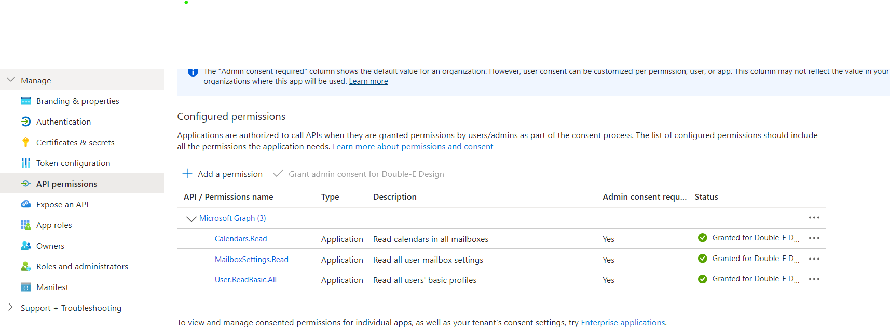

## Microsoft Graph integration

This application requires an app in Azure to handle authentication. You can create one in the [Azure Portal](https://portal.azure.com) > App Registrations. 

Then add you will need to add OAuth, URL, callback, etc details in `server/.env` (all the required keys are listed in that file).

If using service principal authentication, you will need:
- `MS_TENANT_ID`: You can find this in the Azure portal by searching for "Tenant properties".
- `MS_USER_ID`: The email address of the user account you want to use to access your calendars.

For all authentication methods, you will need:
- `MS_CLIENT_ID`: The app's client ID can be found by navigating to App Registrations > life-screen, and in the app overview finding "Application (client) ID"
- `MS_CLIENT_SECRET`: Manage > Certificates & Secrets > "Client Secrets" tab
- `MS_OAUTH_AUTHORITY` is `https://login.microsoftonline.com/organizations/` if you are using Office 365; it's different if you're using a personal @outlook.com account.
- `MS_OAUTH_SCOPES` is `Calendars.Read,User.ReadBasic.All,MailboxSettings.Read` for service principal authentication (see below for other options).

### Auth Option 1: Application-based authentication (service principal)
This option requires admin consent and allows access to all users' calendars in the tenant without user sign-in. Because this is a personal app that I use locally, I use this method for convenience.

1. In the Azure portal > Manage > API Permissions, add the following **application** permissions:
   - Microsoft Graph > Calendars.Read
   - Microsoft Graph > User.ReadBasic.All
   - Microsoft Graph > MailboxSettings.Read

    If you can't grant these permissions, you're not in a global admin account. 
2. Log in to your global admin account
3. Search for and select "Enterprise Applications"
4. Select `life-screen` (or whatever you called your app) from the list
5. In the sidebar, go to Security > Permissions
6. Click "Grant admin consent for [your tenant name]"
7. A pop-up window will appear confirming which permissions are being granted; check that it matches the application permissions you added earlier and if so, click "Accept"
8. Log back in to your day-to-day account and go to the API permissions (as per the above) and check that the application permissions are now granted. It should look something like this:

9. In `.env`, add the scopes `Calendars.Read,User.ReadBasic.All`.
10. Test the connection using the `/msgraph/me` endpoint [via Postman](./testing-integrations.md).

### Auth Option 2: User-based authentication
This option requires user sign-in to access their calendar data.

> [!WARNING]
> Because I now use the service principal method, the code for this has been removed from the app. You will need to implement login and logout routes, sessions, etc. Archived branches of this repo contain examples that worked in the past.

1. In the Azure portal > Manage > API Permissions, add the following **delegated** permissions:
    - Microsoft Graph > User.Read
    - Microsoft Graph > MailboxSettings.Read
    - Microsoft Graph > Calendars.Read
    - Microsoft Graph > Calendars.Read.Shared
2. In `.env`, add the scopes `user.read,mailboxsettings.read,Calendars.Read,Calendars.Read.Shared`. (YMMV, you may not need `Calendars.Read.Shared` if you, well, don't need to read any shared calendars.)
3. Test the connection via Postman as per the [testing instructions](./testing-integrations.md)
4. Install `@azure/msal-node` in your server app to handle the OAuth flow (note: you probably don't need `@azure/identity`; that's used for the service principal method)
5. Implement login and logout routes, sessions, etc. in your app.

---
## Google Calendar integration

1. [Create a Google Cloud project](https://developers.google.com/workspace/guides/create-project) and enable the Calendar API within it.
2. In Google APIs and Services, go to [OAuth consent screen](https://console.cloud.google.com/apis/credentials/consent?project=life-screen). As I am using a personal account, not a Workspace account, I have to choose "external".
3. The next step is Scopes. Search for/find Google Calendar API and select `auth/calendar.acls.readonly`. This should show up under "Your sensitive scopes" when saved.
    - To return to this screen later, go to OAuth Consent Screen, click the "Edit app" button at the top of the page (next to the app name), and re-follow the wizard to get to the Scopes screen.
4. In the next step, add yourself as a test user.
5. Go to [Credentials](https://console.cloud.google.com/apis/credentials?project=life-screen), click the "Create credentials" button, and choose "OAuth client ID". In the wizard that appears, choose "Web application" and enter:
- Authorised JavaScript origins: Your front-end app URL (e.g., `http://localhost:3000`), and your server URL (e.g., `http://localhost:3001`) if you want to be able to test that directly without a front-end app.
- Authorised redirect URIs: The server URL/endpoint that will handle the returned authorisation code (e.g., `http://localhost:3001/auth/callback`).
    - If you're going to test with Postman, also add the Postman redirect URL `https://oauth.pstmn.io/v1/callback`.
6. Click "create" and copy the client ID and secret that appear into your server `.env` file.
